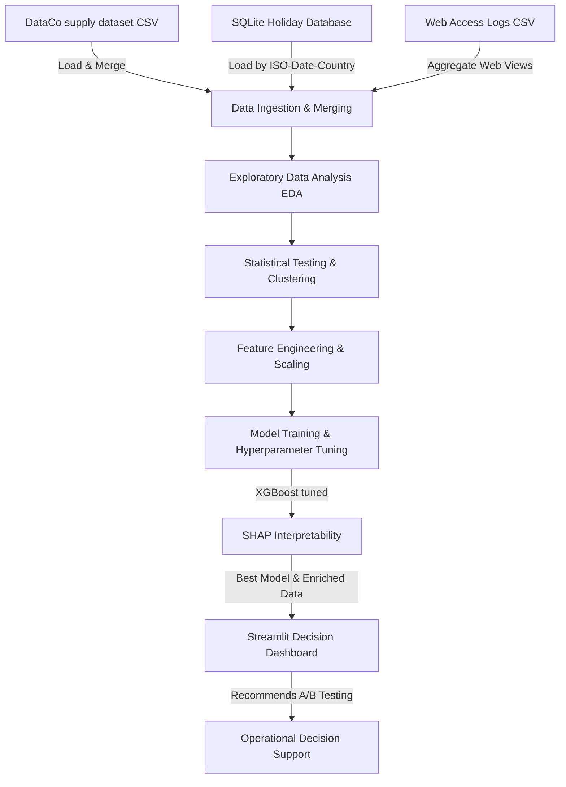

# DataCo Smart Supply Chain: Data-Driven Decision Making

This repository contains the end-to-end data science pipeline and decision-support dashboard for the **DataCo Smart Supply Chain** dataset. The goal of this project is to model late delivery risk, explain the factors driving delivery delays, and propose actionable, data-backed operational policies to mitigate late shipments and recover at-risk profits.

---

## Architecture Diagram

The pipeline ingests raw logistics, web traffic, and public holiday datasets, processes them through feature engineering and predictive modeling, and delivers interactive analytics:



---

## Repository Structure

```text
├── DataCo_Enriched_Final.zip  # Compressed enriched dataset used by the dashboard
├── dashboard.py               # Streamlit application source code
├── requirements.txt           # Project dependencies
├── README.md                  # Documentation and architecture overview
├── data/
│   ├── DataCoSupplyChainDataset.zip     # Original raw transactions dataset
│   ├── DescriptionDataCoSupplyChain.zip # Original data dictionary zip
│   ├── holidays_database.db             # SQLite database of global public holidays
│   └── tokenized_access_logs.zip        # Web access logs zip
└── notebooks/
    └── DDDM_Supply_Chain_Full.ipynb     # Full analytical and modeling notebook
```

---

## Installation & Setup

### Prerequisites
- Python 3.10 or higher.
- `pip` package manager.

### 1. Clone the repository
```bash
git clone https://github.com/kinglouai/Data-Driven-Project.git
cd Data-Driven-Project
```

### 2. Install dependencies
Install all required libraries specified in the project requirements file:
```bash
pip install -r requirements.txt
```

### 3. Extract compressed datasets (Optional)
If you want to run the Jupyter notebook from scratch, unzip the datasets inside the `data/` directory:
```bash
cd data
tar -xf DataCoSupplyChainDataset.zip
tar -xf DescriptionDataCoSupplyChain.zip
tar -xf tokenized_access_logs.zip
cd ..
```

---

## How to Launch

### 1. Launch the Jupyter Notebook
Open the pipeline notebook to review the full methodology from audit to SHAP interpretability:
```bash
jupyter notebook notebooks/DDDM_Supply_Chain_Full.ipynb
```

### 2. Launch the Streamlit Dashboard Locally
To start the interactive decision-support application, run:
```bash
streamlit run dashboard.py
```
This will launch the app in your default web browser (usually at `http://localhost:8501`).

---

## Key Pipeline Features
1. **Multi-Source Data Ingestion**: Blends order transactions, web logs for consumer page-view density, and country-level calendar public holidays from SQLite.
2. **Comprehensive Data Audit**: Profiles completeness, data types, uniqueness, duplicates, and structural missingness.
3. **Exploratory Data Analysis & Clustering**: Uses K-Means to identify distinct logistical customer/transaction segments.
4. **Machine Learning Pipeline**: Compares Logistic Regression, Random Forests, and XGBoost. The hyperparameter-tuned XGBoost model achieves an **AUC-ROC of 0.9487** and **F1-Score of 0.9102**.
5. **Explainable AI (XAI)**: Implements SHAP global beeswarm and local waterfall visualizations to understand risk drivers.
6. **Actionable A/B Testing**: Formulates a detailed test protocol to upgrade standard shipping for high-value items, backed by sample size calculations and power analyses.